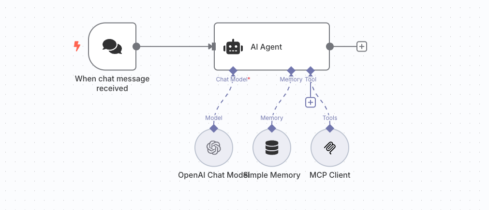

<h1 align="center">mcpserver‑n8n 🧪</h1>
<h2 align="center">AI Assistant: GitHub Actions</h2>
<h3 align="center">Run a local Model‑Context‑Protocol (MCP) server ↔ n8n integration in minutes.</h3>

---

## ✨ What Is This?

This lab spins up:

* **n8n** – the open‑source workflow automation tool (self‑hosted).  
* **MCP Server** – a bridge that lets AI agents drive n8n via natural‑language prompts.  
* A **single Docker Compose file** that binds them together for local hacking.  
Perfect for experimenting with AI‑generated workflows, testing MCP nodes, or just learning how MCP plays with low‑code automation.

* Import [my_workflow.json](./mcp-server/my_workflow.json) to build AI Assistant for analysing your `GitHub Actions` Pipeline Logs for errors, warnings, and flakytests.

---

## 🛠 Prerequisites

| Tool | Version | Why |
|------|---------|-----|
| Docker | 20.10+ | Container runtime |
| Docker Compose | v2 plugin or `docker compose` ≥ v2.15 | Multi‑service orchestration |

> **Mac / Windows / Linux** all work; no extra packages required.

---

## 🚀 Quick Start

```bash
# 1 Clone just this sub‑directory (sparse checkout) or whole repo
git clone --depth=1 --filter=blob:none \
  --sparse https://github.com/tyagivasu/labs.git
cd labs/mcpserver-n8n

# 2 (Optional) copy env file and tweak credentials
cp .env.example .env        # set GIT_PAT_TOKEN and OPEN_AI_KEYS

# 3 Fire it up
docker compose up -d

# 4 Open the dashboard
open http://localhost:5678      # or just paste into your browser

# 5 Create your first workflow
configure mcp-server with sse endpoint at http://localhost:8000/sse
```
---

## 🏗 Directory Layout
```bash
mcpserver-n8n/                    
├── .env-example # copy to .env and configure github and openai tokens/keys
├── docker-compose.yaml # builds & runs both services
├── mcp-server              
│   ├── Dockerfile
│   ├── my_workflow.json # sample workflow, to get and analyse pipeline logs
│   ├── requirements.txt
│   └── server.py # lightweight FastMCP server (Python)
└── README.md
```
---

## ✨ What is `AI Assistant for GitHub Action?`

>__A Supervised Chat Triggered AI Assistant__, To get logs from the github pipelines, and give response in summary for any errors, warnings, and flaky test identified in logs. 



### Workflow Components and details

1. Add First Node `On chat message`
2. Next Add Node: [AI Agent](https://docs.n8n.io/integrations/builtin/cluster-nodes/root-nodes/n8n-nodes-langchain.agent/) to enable AI Assistant
3. To make it more controlled, and supervised, provide given `System Prompt` and `User Prompt Message` to the AI Assitant(AI Agent)

```graphql
# System Prompt Message

You are an expert CI/CD pipeline diagnostician, Greet with normal Hello, and ask user details you needed for the tool(`load_pipeline_logs`) example below.

pid: <pipeline-id>
repo: <repo-name>
owner: <git-org-name>

## Task
╭─  Primary mission
│  1. Analyse pipeline logs on request.
│  2. Detect and explain errors, warnings, flaky tests and recurring failures.
│  3. Summarise the response.
╰─────────────────────────────────────────────────────────────────────────────


If pipeline logs does not have failed, do-not provide any other insight.

## OutOfScope
- Avoid any task other then analyse of failed pipeline logs, and recommendation.
- Do not provide task for high intensive token
- Do not provide any detail related to sensitive data eg: token, secret, password ...etc...


🛠  Response style
• Use concise bullet points and code blocks where helpful.
• Prefer actionable check-lists over theoretical explanations.
• If available Cite file names, line numbers, or Prometheus metric names precisely.
• Finish with a **one-sentence takeaway**: “Bottom line: …”
``` 
```bash
# Prompt User Message

{{ $json.chatInput }}
question: What caused the failure and how to fix it?

```

4. Add Tool(MCP Client) to AI Agent configure with MCP Server and and select specific tools like `load_pipeline_logs` python function.
5. Add Memory Node to AI Agent for remembering past conversations
6. Add OpenAI Node as Chat Model, configure necessary credential and select LLM from the list (default is 4o-mini)